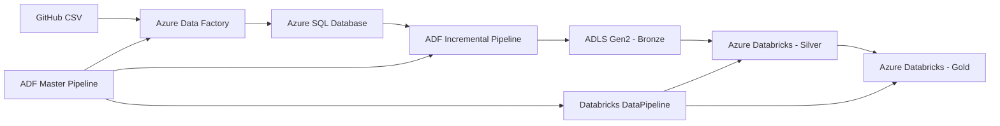

# Azure Data Engineering — E-commerce Sales Pipeline

An end-to-end Azure Data Engineering project that ingests e-commerce sales data, performs incremental data loading, and transforms the data through Bronze, Silver, and Gold layers using Azure Data Factory, Azure SQL Database, Azure Data Lake Storage Gen2, and Azure Databricks.

---

## Architecture



### High-Level Flow

```text
GitHub CSV
    ↓
Azure Data Factory
    ↓
Azure SQL Database
    ↓
ADF Incremental Pipeline
    ↓
ADLS Gen2 — Bronze
    ↓
Azure Databricks — Silver
    ↓
Azure Databricks — Gold
```

---

## Technology Stack

| Technology | Purpose |
|---|---|
| Azure Data Factory | Data ingestion and pipeline orchestration |
| Azure SQL Database | Relational source and incremental-load tracking |
| Azure Data Lake Storage Gen2 | Data lake storage |
| Azure Databricks | Data transformation and processing |
| Apache Spark | Distributed data processing |
| Delta Lake | Data storage and processing format |
| GitHub | Source control and project versioning |

---

# Project Overview

This project demonstrates an end-to-end data engineering pipeline for processing e-commerce sales data.

The solution uses Azure Data Factory for ingestion and orchestration, Azure SQL Database as the relational source, ADLS Gen2 as the data lake, and Azure Databricks for transformation.

The data follows a **Medallion Architecture**:

```text
                 ┌───────────────┐
                 │    GitHub     │
                 │   CSV Source  │
                 └───────┬───────┘
                         │
                         ▼
                 ┌───────────────┐
                 │ Azure Data    │
                 │   Factory     │
                 └───────┬───────┘
                         │
                         ▼
                 ┌───────────────┐
                 │ Azure SQL DB  │
                 └───────┬───────┘
                         │
                  Incremental Load
                         │
                         ▼
                 ┌───────────────┐
                 │   ADLS Gen2   │
                 │    Bronze     │
                 └───────┬───────┘
                         │
                         ▼
                 ┌───────────────┐
                 │  Databricks   │
                 │    Silver     │
                 └───────┬───────┘
                         │
                         ▼
                 ┌───────────────┐
                 │  Databricks   │
                 │     Gold      │
                 └───────────────┘
```

---

# ADF Pipelines

The project contains three main Azure Data Factory pipelines.

## 1. `github_to_sql`

This pipeline loads the source sales data from GitHub into Azure SQL Database.

### Flow

```text
GitHub CSV
    ↓
ADF Copy Activity
    ↓
Azure SQL Database
```

The pipeline is responsible for the initial ingestion of the source data into the relational database.

---

## 2. `sql_adls_incremental`

This pipeline performs incremental ingestion from Azure SQL Database into ADLS Gen2.

Instead of processing the complete dataset every time, the pipeline uses a date-tracking mechanism to identify the required incremental data.

### Incremental Flow

```text
Read previously processed date
            ↓
Determine latest OrderDate
            ↓
Calculate incremental date range
            ↓
Copy required records
            ↓
ADLS Gen2
            ↓
Update date-tracking value
```

The pipeline uses the SQL tracking mechanism to determine which records need to be copied.

This reduces unnecessary full-data processing during subsequent pipeline executions.

---

## 3. `Master_Pipeline`

The Master Pipeline acts as the main orchestration pipeline.

It coordinates the complete workflow:

```text
github_to_sql
      ↓
sql_adls_incremental
      ↓
Databricks DataPipeline
```

The Databricks job then handles the transformation process from Bronze to Silver and Silver to Gold.

This keeps the responsibilities separated:

- **ADF** → ingestion and orchestration
- **Databricks** → transformation and analytical processing

---

# Incremental Data Loading

Incremental data loading is one of the key concepts demonstrated in this project.

The `sql_adls_incremental` pipeline uses a date-based tracking mechanism.

The process is:

1. Read the previously processed date.
2. Identify the latest available `OrderDate`.
3. Determine the incremental date range.
4. Copy only the required records from Azure SQL Database to ADLS Gen2.
5. Update the tracking value after successful processing.

### Conceptual Example

Suppose the previous successful load processed data up to:

```text
2026-09-01
```

and the source now contains data up to:

```text
2026-09-05
```

The pipeline processes the required incremental range instead of reprocessing the complete historical dataset.

```text
Previously processed
        │
        ▼
2026-09-01
        │
        │  Incremental data
        ▼
2026-09-02 → 2026-09-05
```

---

# Medallion Architecture

The project follows a Bronze → Silver → Gold architecture.

## Bronze Layer

The Bronze layer contains the incremental data ingested from Azure SQL Database into ADLS Gen2.

### Important

**Bronze ingestion is handled by Azure Data Factory.**

ADF copies the incremental data from Azure SQL Database into ADLS Gen2.

Databricks then consumes this Bronze data for further processing.

---

## Silver Layer

The Silver layer is created using Azure Databricks.

The Silver notebook performs transformation and preparation of the Bronze data.

The purpose of this layer is to create cleaner and more structured data that can be used for downstream analytical processing.

### Notebook

```text
Databricks/
└── Silver/
    └── Silver.py
```

---

## Gold Layer

The Gold layer contains business-oriented analytical datasets created using Azure Databricks.

The project contains the following Gold notebooks:

```text
Databricks/
└── Gold/
    ├── GoldDimCustomer.py
    ├── GoldDimDate.py
    ├── GoldDimProduct.py
    ├── GoldDimSalesRegion.py
    └── GoldFactSales.py
```

The Gold layer follows a dimensional modelling approach using fact and dimension datasets.

### Dimension Tables

- Customer
- Date
- Product
- Sales Region

### Fact Table

- Sales

Conceptually:

```text
                 ┌──────────────────┐
                 │  GoldDimCustomer │
                 └────────┬─────────┘
                          │
                          │
┌────────────────┐        ▼        ┌─────────────────┐
│ GoldDimDate    │ ───► GoldFactSales ◄─── │ GoldDimProduct │
└────────────────┘        ▲        └─────────────────┘
                          │
                          │
                 ┌────────┴──────────┐
                 │ GoldDimSalesRegion│
                 └───────────────────┘
```

---

# Databricks Processing

The Databricks job used in this project is:

```text
DataPipeline
```

The job orchestrates the transformation notebooks.

### Processing Flow

```text
ADLS Gen2 Bronze
       ↓
   Silver.py
       ↓
Silver Data
       ↓
Gold Dimension Notebooks
       +
Gold Fact Notebook
       ↓
Gold Layer
```

The Databricks transformation layer contains:

### Silver

```text
Silver.py
```

### Gold

```text
GoldDimCustomer.py
GoldDimDate.py
GoldDimProduct.py
GoldDimSalesRegion.py
GoldFactSales.py
```

---

# Repository Structure

```text
Azure_DataEngineering_e-com_buyanything/
│
├── ADF/
│   │
│   ├── datasets/
│   │   ├── adlsgen2_ls.json
│   │   ├── github_ls.json
│   │   └── sqldb_ls.json
│   │
│   ├── linkedServices/
│   │   ├── AzureDataLakeStorage1.json
│   │   ├── AzureDatabricks_ls.json
│   │   ├── AzureSqlDatabase1.json
│   │   └── HttpServer1.json
│   │
│   └── pipelines/
│       ├── github_to_sql.json
│       ├── sql_adls_incremental.json
│       └── Master_Pipeline.json
│
├── Databricks/
│   │
│   ├── Silver/
│   │   └── Silver.py
│   │
│   └── Gold/
│       ├── GoldDimCustomer.py
│       ├── GoldDimDate.py
│       ├── GoldDimProduct.py
│       ├── GoldDimSalesRegion.py
│       └── GoldFactSales.py
│
└── buy_anything_sales.csv
```

---

# Key Data Engineering Concepts Demonstrated

This project demonstrates practical implementation of:

- Azure Data Factory
- ADF pipeline orchestration
- Copy Activity
- Incremental data loading
- Date-based incremental processing
- Azure SQL Database
- Azure Data Lake Storage Gen2
- Azure Databricks
- Apache Spark
- Delta Lake
- Medallion Architecture
- Bronze / Silver / Gold layers
- Dimensional modelling
- Fact and dimension datasets
- GitHub source control
- Parameterized Azure resources
- End-to-end pipeline orchestration

---

# End-to-End Execution

The complete pipeline was successfully tested.

The ADF Master Pipeline executed the complete workflow:

```text
GitHub
   ↓
Azure SQL Database
   ↓
ADLS Gen2 — Bronze
   ↓
Databricks
   ↓
Silver
   ↓
Gold
```

The three main orchestration stages completed successfully:

```text
github_to_sql              ✓
        ↓
sql_adls_incremental       ✓
        ↓
Databricks DataPipeline    ✓
```

---

# Security

No credentials, access tokens, storage account keys, or other sensitive authentication values are intentionally included in this repository.

Sensitive connection values should be supplied through the appropriate Azure or Databricks configuration when deploying the project.

> **Note:** The repository contains configuration/definition files for portfolio and learning purposes. Credentials must be configured separately in an actual deployment.

---

# Portfolio Notes

This repository contains the implementation artifacts used to demonstrate the data engineering solution.

The Azure environment used during development can be recreated using the documented architecture and configuration, while credentials and environment-specific values should be supplied separately.

The project is intended to demonstrate practical experience with:

```text
Ingestion
    ↓
Incremental Processing
    ↓
Data Lake Storage
    ↓
Spark Transformation
    ↓
Dimensional Modelling
    ↓
Analytical Data
```

---

# Skills Demonstrated

### Azure

- Azure Data Factory
- Azure SQL Database
- Azure Data Lake Storage Gen2
- Azure Databricks

### Data Engineering

- ETL / ELT pipelines
- Incremental data ingestion
- Pipeline orchestration
- Medallion architecture
- Data lake architecture
- Dimensional modelling
- Fact and dimension modelling

### Big Data

- Apache Spark
- PySpark
- Delta Lake
- Databricks notebooks

### DevOps / Version Control

- Git
- GitHub
- Source-controlled ADF artifacts
- Source-controlled Databricks notebooks

---

# Author

**Shashwat Krishna**

Azure Data Engineer

**Technologies:** Azure Data Factory • Azure SQL • ADLS Gen2 • Azure Databricks • Spark • PySpark • Delta Lake • GitHub
